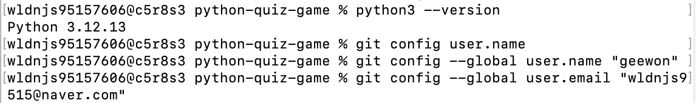
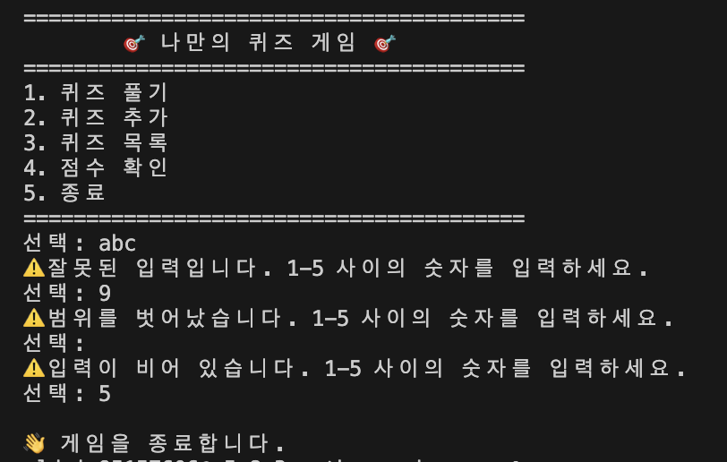
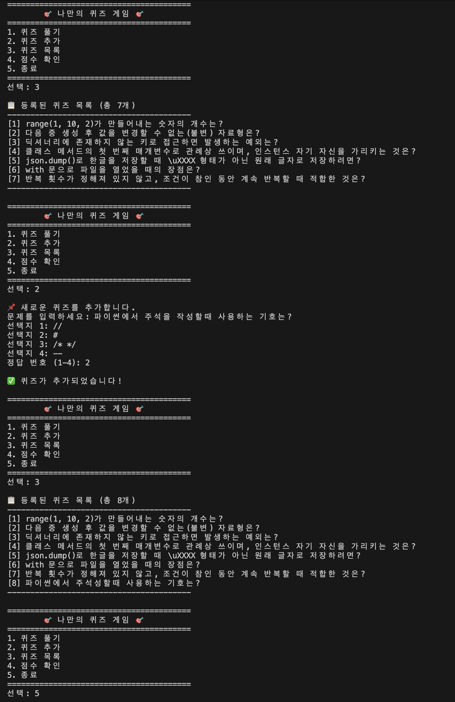
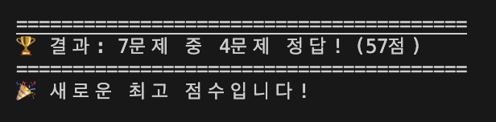
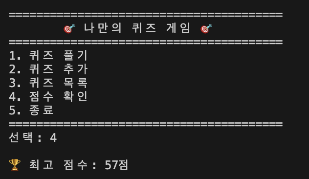
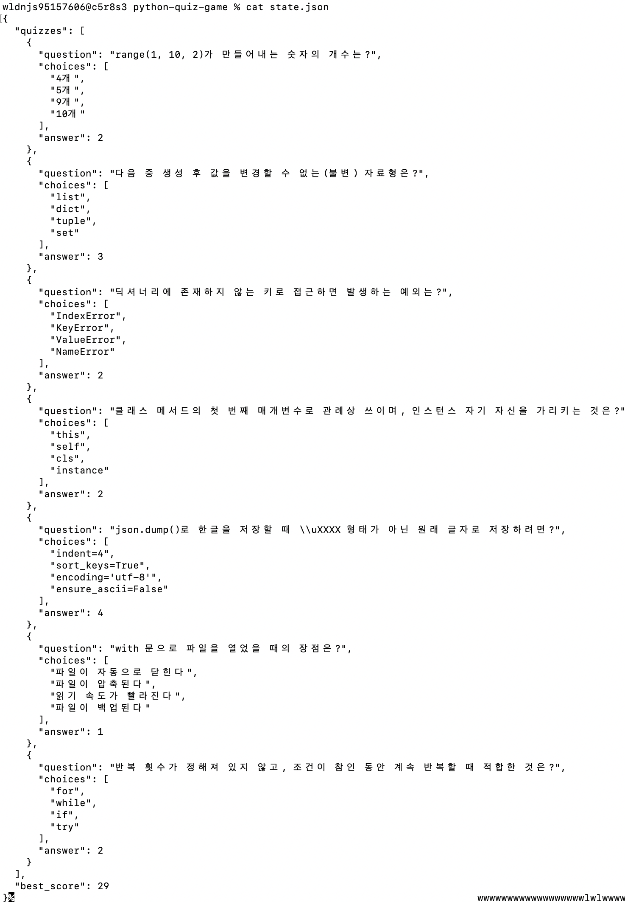
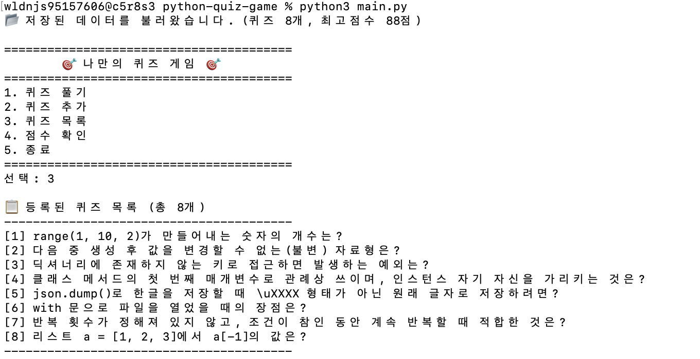
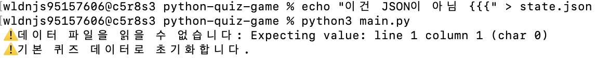
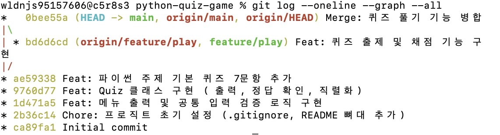

# 나만의 퀴즈 게임 (Python)

터미널에서 동작하는 파이썬 콘솔 퀴즈 게임입니다.
파이썬 기본 문법과 클래스(객체 지향), JSON 파일 입출력을 활용해 구현했으며,
프로그램을 종료하고 다시 실행해도 추가한 퀴즈와 최고 점수가 유지됩니다.

## 프로젝트 개요

- 메뉴에서 번호를 선택해 퀴즈 풀기 / 추가 / 목록 확인 / 점수 확인을 수행하는 콘솔 프로그램입니다.
- `Quiz`(문제 한 개)와 `QuizGame`(게임 전체 흐름) 두 개의 클래스로 역할을 분리했습니다.
- 모든 데이터는 프로젝트 루트의 `state.json`에 UTF-8로 저장되어, 재실행 시 그대로 복원됩니다.
- 외부 라이브러리 없이 파이썬 표준 라이브러리(`json`, `os`)만 사용했습니다.

## 퀴즈 주제와 선정 이유

**주제: 파이썬 기초 문법**

파이썬을 처음 배우는 과제인 만큼, 학습한 내용을 그대로 문제로 만들면서 복습할 수 있는 주제를 골랐습니다.
자료형, 예외, 클래스, 파일 입출력, 반복문 등 이번 미션을 구현하면서 **실제로 사용한 개념** 위주로 문제를 구성해,
게임을 만드는 과정과 문제를 푸는 과정에서 같은 내용을 두 번 익히도록 했습니다.

예를 들어 `json.dump()`로 한글을 저장할 때 `ensure_ascii=False`가 필요하다는 문제는,
이 프로젝트의 `state.json` 저장 기능을 만들면서 직접 겪은 내용입니다.

## 실행 방법

**요구 환경:** Python 3.10 이상 (외부 라이브러리 설치 불필요)

```bash
git clone https://github.com/geewon07/python-quiz-game.git
cd python-quiz-game
python3 main.py
```

첫 실행 시에는 `state.json`이 없으므로 기본 퀴즈 7문항으로 시작하며,
프로그램을 종료할 때 현재 상태가 `state.json`에 자동 저장됩니다.

## 기능 목록

| 메뉴 | 기능 | 설명 |
| --- | --- | --- |
| 1 | 퀴즈 풀기 | 등록된 모든 퀴즈를 순서대로 출제하고 채점합니다. 100점 만점으로 환산해 최고 점수와 비교·갱신합니다. |
| 2 | 퀴즈 추가 | 문제, 선택지 4개, 정답 번호를 입력받아 새 퀴즈를 등록하고 파일에 저장합니다. |
| 3 | 퀴즈 목록 | 등록된 퀴즈의 문제를 번호와 함께 보여줍니다. (정답은 표시하지 않음) |
| 4 | 점수 확인 | 저장된 최고 점수를 확인합니다. 기록이 없으면 안내 메시지를 출력합니다. |
| 5 | 종료 | 현재 데이터를 저장한 뒤 프로그램을 종료합니다. |

### 입력 및 예외 처리

숫자 입력은 `read_int()` 함수 한 곳에서 처리하여 다음 경우를 모두 처리합니다.

- 입력 앞뒤의 공백 제거 (`" 1 "` → `1`)
- 숫자로 변환할 수 없는 입력 (`abc`) → 안내 후 재입력
- 허용 범위를 벗어난 숫자 (메뉴 `9`, 정답 `0`) → 안내 후 재입력
- 빈 입력(Enter만 누른 경우) → 안내 후 재입력

또한 다음 상황에서도 비정상 종료되지 않습니다.

- `Ctrl+C`(KeyboardInterrupt) 또는 입력 스트림 종료(EOFError) → 안내 출력 후 데이터를 저장하고 종료
- `state.json`이 없는 경우 → 기본 퀴즈 데이터로 시작
- `state.json`이 손상된 경우 → 안내 출력 후 기본 퀴즈 데이터로 초기화

## 파일 구조

```
python-quiz-game/
├── main.py              # 전체 소스 코드 (Quiz, QuizGame 클래스 및 실행 로직)
├── state.json           # 퀴즈 목록과 최고 점수 저장 파일 (실행 시 자동 생성, Git 추적 제외)
├── .gitignore           # state.json, __pycache__ 등 제외 설정
├── README.md
└── docs/
    └── screenshots/     # 실행 화면 캡처
```

### `main.py` 내부 구조

| 구성 요소 | 역할 |
| --- | --- |
| `Quiz` 클래스 | 문제 한 개를 표현. 문제 출력(`show`), 정답 확인(`is_correct`), JSON 변환(`to_dict` / `from_dict`) |
| `QuizGame` 클래스 | 게임 전체 관리. 퀴즈 목록과 최고 점수를 속성으로 보관하고, 메뉴 루프(`run`)와 저장/불러오기(`save` / `load`)를 담당 |
| `read_int` / `read_text` | 공통 입력 검증 함수. 모든 입력 예외 처리를 한 곳에 모음 |
| `play_quiz` / `add_quiz` / `show_quiz_list` / `show_best_score` | 각 메뉴의 화면 출력과 입력 흐름 담당 |
| `DEFAULT_QUIZ_DATA` | 기본 퀴즈 7문항 데이터 |

## 데이터 파일 설명 (`state.json`)

- **경로:** 프로젝트 루트의 `state.json`
- **인코딩:** UTF-8 (`ensure_ascii=False`로 저장하여 한글이 그대로 보이도록 함)
- **역할:** 등록된 퀴즈 목록과 최고 점수를 보관. 퀴즈를 추가하거나 최고 점수가 갱신될 때, 그리고 프로그램 종료 시 저장됩니다.
- **Git 추적 제외:** 실행할 때마다 내용이 바뀌는 런타임 데이터이므로 `.gitignore`에 등록했습니다. 저장소를 새로 clone하면 기본 퀴즈 7문항으로 시작합니다.

### 스키마

```json
{
  "quizzes": [
    {
      "question": "range(1, 10, 2)가 만들어내는 숫자의 개수는?",
      "choices": ["4개", "5개", "9개", "10개"],
      "answer": 2
    }
  ],
  "best_score": 57
}
```

| 필드 | 타입 | 설명 |
| --- | --- | --- |
| `quizzes` | list | 퀴즈 객체의 배열 |
| `quizzes[].question` | str | 문제 내용 |
| `quizzes[].choices` | list[str] | 선택지 4개 |
| `quizzes[].answer` | int | 정답 번호 (1~4) |
| `best_score` | int \| null | 최고 점수(100점 만점). 기록이 없으면 `null` |

> `best_score`를 `0`이 아닌 `null`로 둔 이유는, "아직 풀지 않은 상태"와 "모두 틀려서 0점"을 구분하기 위해서입니다.

## 실행 화면

### 개발 환경


### 메뉴 화면 및 잘못된 입력 처리


문자(`abc`), 범위 밖 숫자(`9`), 빈 입력에 각각 다른 안내 메시지가 출력됩니다.

### 퀴즈 추가 및 목록 확인


목록(7개) → 퀴즈 추가 → 목록 재확인(8개) 순으로 동작을 확인한 화면입니다.

### 퀴즈 풀기 및 채점


### 점수 확인


### 데이터 파일 (state.json)


`ensure_ascii=False` 옵션 덕분에 한글이 `\uXXXX` 이스케이프 없이 그대로 저장됩니다.

### 데이터 영속성


프로그램을 종료한 뒤 다시 실행했을 때, 추가한 퀴즈와 최고 점수가 그대로 복원되는 것을 확인한 화면입니다.

### 손상된 파일 복구


`state.json`이 JSON 형식이 아닐 때 안내 메시지를 출력하고 기본 퀴즈 데이터로 초기화합니다.

### Git 커밋 이력


`feature/play` 브랜치에서 퀴즈 풀기 기능을 개발한 뒤, `--no-ff` 옵션으로 병합한 이력을 확인할 수 있습니다.

## 배운 점

- 문법을 아는 것과 하나의 프로그램을 완성하는 것이 다르다는 것을 체감했습니다. 특히 입력 검증처럼 사소해 보이는 부분이 여러 곳에서 반복되면서, 공통 함수로 분리하는 것이 왜 필요한지 알게 되었습니다.
- 처음에는 함수들이 `quizzes`와 `best_score`를 인자로 계속 주고받는 구조였는데, `QuizGame` 클래스로 상태를 모으면서 코드가 훨씬 단순해졌습니다. 클래스를 "왜" 쓰는지를 리팩터링 과정에서 이해했습니다.
- 기능 단위로 커밋하고 브랜치를 나눠 작업해 보면서, Git 이력 자체가 개발 과정의 기록이 된다는 점을 경험했습니다.

---
_원격 저장소 clone 및 pull 실습을 위해 복제본에서 추가한 줄입니다._
